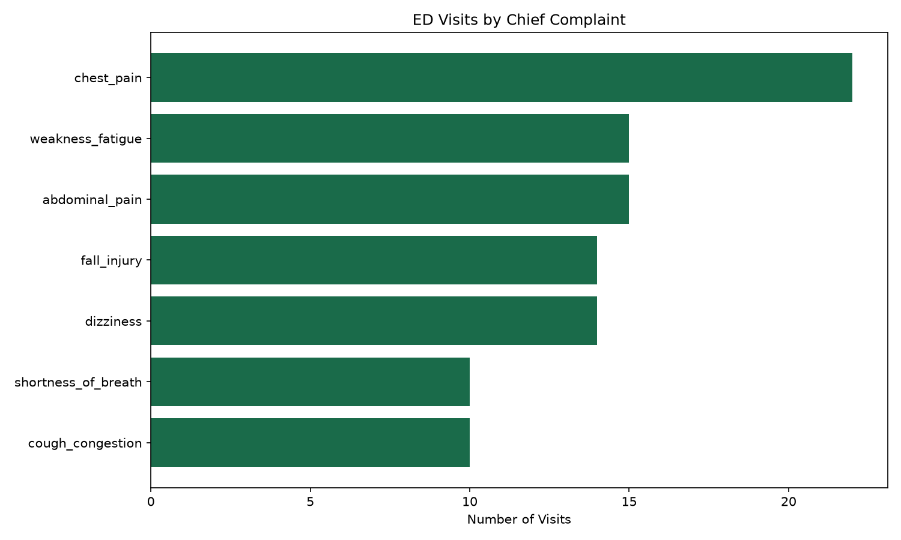
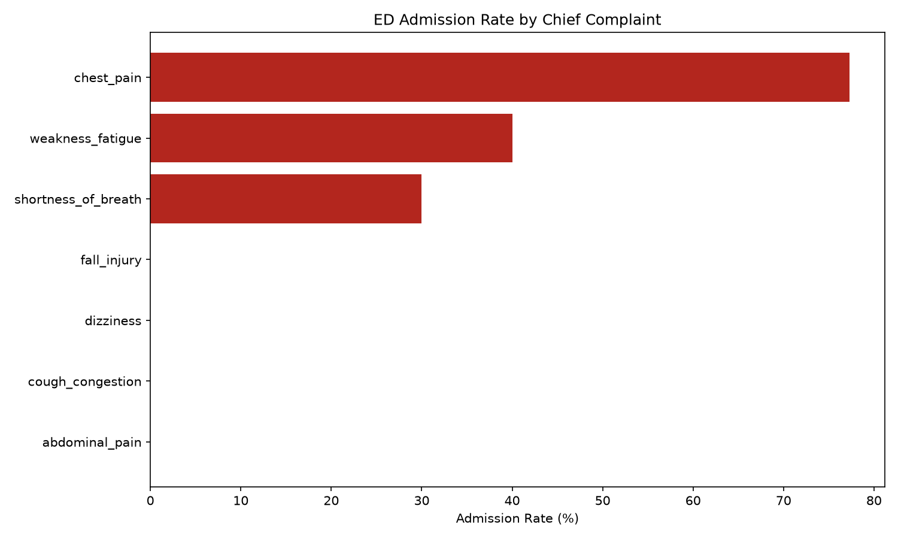
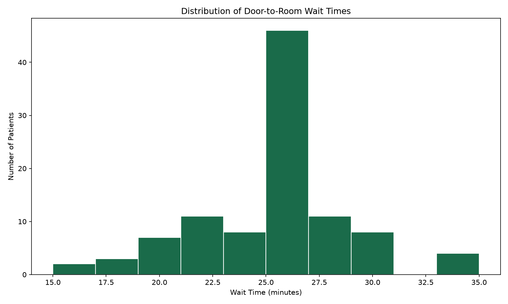

# Week 4 Analysis — Visualizing ED Throughput & Admission Patterns

## Goal

Translate the Week 2/3 analytical findings into visualizations using
Matplotlib, and use the charts themselves to surface patterns that
weren't obvious from summary tables alone.

## Methodology

Three charts were generated from the `ed_encounter` dataset, each
saved as a `.png` to `assets/`:

1. **Visit volume by chief complaint** — horizontal bar chart
2. **Admission rate by chief complaint** — horizontal bar chart
3. **Wait time distribution** — histogram

All three reuse the same `load_encounters()` function (`db.py`) and
shared pandas transformation helpers (`transforms.py`) established in
Week 3, confirming that once data is shaped correctly for analysis,
visualization becomes a thin layer on top rather than a separate
effort. This week's refactor also moved query strings, transformations,
analysis, and plotting into their own modules (`queries.py`,
`transforms.py`, `analysis.py`, `plots.py`) to keep `app.py` as a thin
dispatcher rather than a growing monolith.

## Findings

### Visit Volume by Complaint

Chest pain leads at 22 visits, with abdominal pain and weakness/fatigue
tied at 15. Cough congestion and shortness of breath are the least
common at 10 each.

### Admission Rate by Complaint

The chart makes the gap far more visible than the table did in Week 2:
chest pain sits at ~77%, then drops sharply to weakness_fatigue (40%)
and shortness_of_breath (30%), with four complaints flatlining at 0%.

### Wait Time Distribution

The histogram reveals something the summary statistics alone didn't
show clearly: a sharp spike around 25-27 minutes, a gap around 31-33
minutes, and a small secondary cluster near 35 minutes — rather than a
smooth bell curve. This pattern suggests the synthetic data generator
draws from a limited set of discrete wait-time values rather than a
continuous distribution.

## Takeaways

- Visualizing a distribution can reveal structural artifacts (like
  discrete value clustering) that summary statistics such as mean and
  std deviation can mask.
- The admission rate chart communicates the chest-pain-dominant pattern
  far more immediately than the equivalent table — a chart earns its
  place when it makes a relationship visible at a glance rather than
  requiring the reader to scan numbers.
- Reusing the same data-loading and transformation functions across
  print statements, tables, and now charts confirms the value of
  separating "get and shape the data" from "present the data."
- Splitting the project into `db.py`, `queries.py`, `transforms.py`,
  `analysis.py`, and `plots.py` removed duplicated logic — the
  admission rate calculation and wait time calculation had each been
  written three times across different functions before being
  consolidated into single shared functions in `transforms.py`.

## Data Note

All data is synthetic, generated to mirror the schema of a real ED
encounter table. No real patient data (PHI) is used anywhere in this
project. The discrete clustering observed in the wait time histogram
is a property of the synthetic data generation and would not be
expected in real-world ED data.
